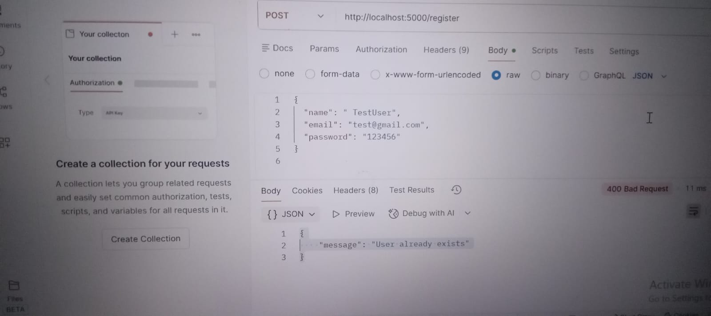
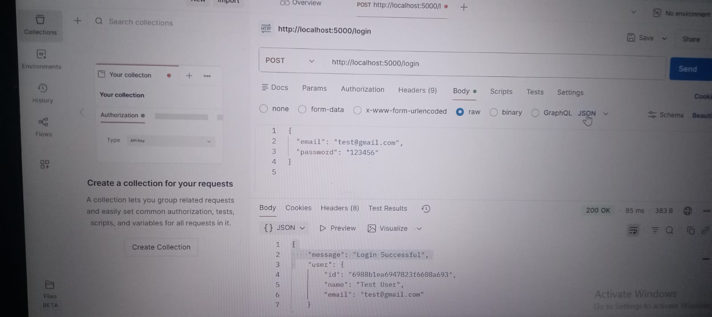
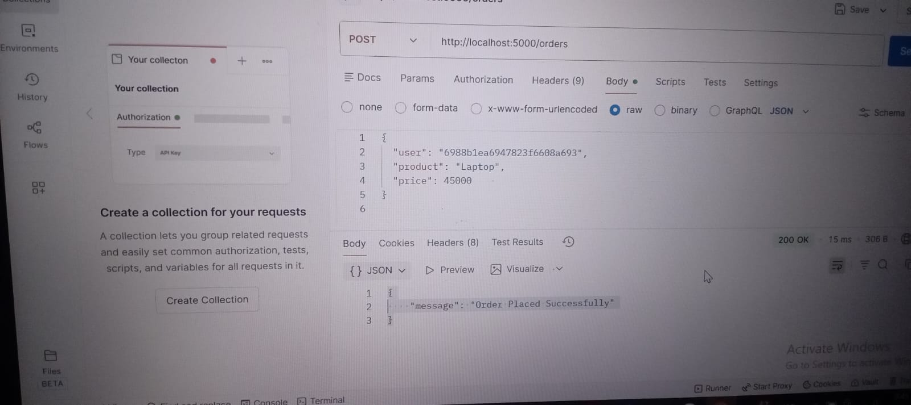

# CodeAlpha_EcommerceStore
## Task-1: Simple E-commerce Store
Description:
A simple E-commerce web application built with HTML, CSS, JavaScript, and Django (Python) / Express.js (Node.js).
Features include:

Product listings with detailed pages

Shopping cart functionality

User registration and login system

Order processing

Database management for products, users, and orders

This project demonstrates a full-stack approach to building an online store, combining frontend design with backend logic and database integration.

Built with **Node.js + MongoDB + Frontend (HTML, CSS, JS)**

---

## Project Screenshots

### CMD - Server Running & API Test

### Products Page

### Register page

### login page

### Order Page

